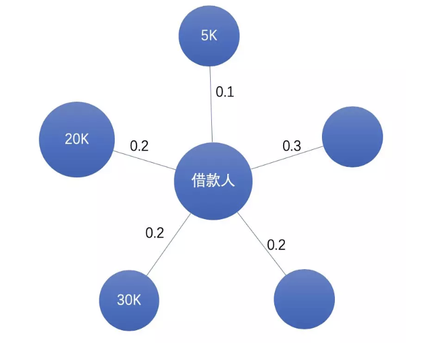

# 1. 传统方法

在信贷领域主要有两种风险：

**欺诈风险：**借款人的目的就是骗贷。

**信用风险：**又称违约风险，是借款人因各种原因，不愿或无力履行合同条件而构成违约，致使平台遭受损失。

---

​		针对信用风险，需要对借款人的财务状况、还款意愿、履约能力等各方面因素综合量化评估，并根据风险等级制定不同的差异化定价（不同额度利率）和策略。

==白话一点的解释就是：==

**业务：**需要训练一个模型，去预测借款人违约概率，并根据违约概率高低表示信用好坏，信用好的给予更高的额度和更低的贷款利率，针对信用较差的制定更严格的审核，更高的利率。

**模型：**传统是使用评分卡，可解释性比较好。但现在越来越多会使用机器学习（如XGBoost），快速出结果且效果更好。

**特征：**上图针对各个维度设计，并保证可解释性。

**样本：**历史上是否违约的人群作为训练样本（都是钱啊）。

# 2. 复杂网络

如何将借款人所处的系统抽象成复杂网络？下面介绍基础层次和业务层次的抽象，最终得到什么样的复杂网络，以及为什么要这样做。

## 2.1 基础层次抽象

从原始数据中提取节点及关系抽象成复杂网络：

节点：用户、商户、公司、设备、LBS、IP/WIFI

关系：社交、消费、就职、使用、位置、上网

## 2.2 业务层次抽象

物以类聚，人以群分，一个人周围邻居的信用资质可以反应其自身信用资质。

基于上述业务假设对网络进一步抽象：

节点：用户

关系：社交、同位置、同设备、同公司、同商户、同WIFI....

我们为每个节点附上信用资质，最终可以得到一个复杂网络。

==为什么要这么做？==

1. 基础层次的抽象可以供多个不同的业务使用。

2. 基于业务经验对数据进一步精炼 garbage in garbage out。

3. 适用同类型节点的算法较多，计算复杂度低。

4. 压缩图，减少降低噪声以及缓解数据稀疏性。

==**目标**==

我们可以从复杂网络中抽取什么信息呢？

**邻居属性：**邻居信用资质。

**异构关系：**不同关系的邻居的信息。

**拓扑结构：**周围邻居的拓扑结构信息

**实体交互：**节点资质和邻居资质是如何交互的？

## 2.3 挖掘

如何提取以上的信息？

上面的模型都可以是解决方案，但是也存在着一定的局限：

1. 首先GNN是黑箱，解释性不够，对于和钱直接相关的业务，对解释性的要求非常高。

2. 稳定性：金融模型上线会运行很久，对稳定性要求较高。

3. 性价比，虽然对图经过了压缩，但是也有亿级别规模，落地成本比较大，包括训练架构、算法优化等等。

==如何解决这些局限性呢？==

拆解上面算法，提取关键模块，用数理统计方法解题：

1. 聚合直接相连邻居特征：参考单层卷积的aggregator操作，其实也就是对邻居特征不带参数求mean、max、加权平均；
2. 获得k跳邻居特征及拓扑：可以尝试多层递归卷积 / 社区发现；
3. 与邻居特征做交互：拼接、比较、平均；
4. 如何融合异构关系：每种关系网络都通过上述方法衍生特征，不同业务通过模型来学习权重。

## 2.4 工程落地

某场景：借款人提交完认证资料后，触发信用评估并返回额度和利率，对时效性要求较高。

离线+实时 实现t跳邻居特征计算

离线：T+1计算好所有节点(t-1跳)特征，存储在HBASE上。

实时：借款人提交完资料后，实时查找其一跳邻居(如mysql)，调用HBASE查找每一个邻居特征，并聚合和交互生成特征。(一跳计算实时可以满足，如果谁说二跳计算实时也可以支持那就牛逼了)。

复杂网络在风控中更多是“找黑的”，比如反欺诈规则关联 *N* 个黑名单，*N* 个中介，以及团伙挖掘等。

本文是从“找白的”角度下介绍复杂网络在信用资质上的应用，方法具有普适性，在找黑的上验证效果也不错：）。

如果精力/资源有限，建议优先选择某类关系和某些节点特征进行实验：

**关系选择：**优选覆盖度较高、噪声低、符合业务直觉的关系，如社交、支付，像LBS虽然覆盖度高，但是噪声也是比较大，在使用时需要谨慎。

**节点特征选择**：优先选择已被验证效果不错的特征，如收入、信用额度等。

另外值得注意的是，比较容易数据穿越，有多个时间需要考虑，如”申请时间“、“建立关系时间”、“特征时间”等。

## 2.5 具体实践

### 2.5.1 聚合一跳邻居特征

一跳邻居即直接相连的邻居，我们需要设计一个聚合函数，在考虑关系权重的基础上，如何表示一跳邻居特征分布。

如下图所示，假设是关系为亲密度、节点特征为收入，如何聚合借款人不同亲密度的邻居收入特征？
我们可以设计这样的聚合函数来加工信息（不考虑未知）：

**简单平均：**
$$
\frac{5k+20k+30k}{3}=18.3k
$$
假设不同亲密度的朋友对借款人信用风险的影响是相同的（假设收入一样）。

**加权平均：**
$$
\frac{0.1\times 5k+0.2\times 20k+0.2\times 30k}{0.1+0.2+0.3}=21k
$$
假设亲密好友收入高低对借款人信用风险影响较大。

**最大值：**
$$
\max\{5k,20k,30k\}=30k
$$
假设亲密好友收入高低对借款人信用风险影响较大。

哪个聚合函数效果比较好？不同聚合函数的业务假设是不同的，建议都使用。特征工程即把可能有用的特征都加工出来，再通过 y 做特征选择。

特征取值“未知”，怎么处理？因为未知其实也可能包含信息，建议聚合计算分考虑未知和不考虑未知进行计算。

邻居特征是离散的，怎么聚合？转换成one-hot编码，计算在属于某个类别邻居比例。

### 2.5.2 聚合多跳邻居特征

问题：邻居数量随着“跳数”增加而指数增长，直接获得借款人多跳邻居比较困难。假设平均节点度为100，那么每个借款人一跳邻居数量为100，二跳邻居100^2，三跳邻居100^3。

下面介绍“多跳递归传播”和”社区发现“这两种方法

#### 2.5.2.1 **多跳递归传播**

以计算二跳邻居特征为例，该方法大概的思路是：将当前节点的二跳邻居特征传播到一跳邻居上，然后将一跳邻居新特征再传播到当前节点。

细节：

1. 因为每次传播只会涉及直接相连的邻居，故计算复杂度大为降低。

2. 原文前向传播计算是带参数W的，这里简化为将所有参数相等（因为是特征工程，不是学习，故会损失一些信息）

3. 对邻居节点进行固定数量抽样，而不是取全部（避免数据倾斜），采样方法使用计算复杂度为O(1)的Alias Method。

4. 递归实现，每轮对所有节点聚合其邻居（隐）特征及交互，并更新节点特征，作为下一轮输入。

5. 第一轮得到所有节点一跳邻居特征，第二轮得到二跳邻居特征，以此类推。

#### 2.5.2.2 **社区发现**

大致思路：通过社区发现算法将graph分成一个个社区，然后计算每个节点所属社区的特征，如社区中黑名单比例、社区中平均收入。

这种方法相当于对多跳邻居根据拓扑结构进行了分类（社区），故额外提取了网络中拓扑结构信息。

工业界graph规模比较大，一般会用Louvain，速度快，效果也不错，下面是spark版本实现：

https://link.zhihu.com/?target=https%3A//github.com/Sotera/spark-distributed-louvain-modularity

### 2.5.3 **实体间特征交互**

聚合邻居特征h1后，如何与自身特征h2做交互？

拼接：直接将h1拼接作为其一个新的特征

比较：h1-h2 或者 h1/h2 。例如求邻居平均收入与借款人自身收入差距较大，是否有异常？

平均：(h1+h2)/2。

最大值：max(h1,h2)，金融是重召回的，若特征表示风险程度，这样即取最大风险。

### 2.5.4 **处理不同异构关系**

将异构关系拆成多个单一关系，每个关系都经过上述方法生成特征，供下游不同场景使用。

这样做的好处是：不同关系权重在不同场景是不同的，应该是通过这些场景的y去学习。

形式化描述：

有$|D|$种类型关系，则可以拆解为$|D|$个graph: $\{g^{\{d\}}=(V,E^{(d)},d\in |D|)\}$

将上面提取graph特征方法记为 $f$

对每个$g^{\{d\}}$，都可以通过方法$f$ 提取特征$X^{\{d\}}=f(g^{\{d\}})$

将不同的$X^{\{d\}}$作为下游任务的输入特征，根据任务目标来赋予权重。

借鉴蚂蚁处理异构网络的思路：

https://zhuanlan.zhihu.com/p/59666737

# 3. 附录

## 3.1 不同社区发现算法比较

在实际小规模graph上对比了主流的社区发现算法，Louvain在划分社区质量和划分稳定性上均表现不错的，且能分布式实现。

### **3.1.1 社区发现算法**

- Walktrap：基于随机游走的社区发现算法 《Computing communities in large networks using random walks》

- Leading Eigenvector：基于特征矩阵求模块度，自底而上定层次聚类《Finding community structure in networks using the eigenvectors of matrices》

- Fast-Greedy：自底而上的层次聚类《Finding community structure in very large networks》

- Louvain：基于模块度最大化的算法《Fast unfolding of communities in large networks》

- LPA：基于标签传播多社区发现算法 《Near linear time algorithm to detect community structures in large-scale networks.》

  

### **3.1.2 实验graph**

下面是脱敏后的实验网络的规模：

### **3.1.3 划分质量：模块度指标**

### **3.1.4 划分数量合理性**

### **3.1.5 可视化**

这是louvain划分的某个graph的可视化效果（绘制工具：gephi）

> **感谢**
>
> 参考原文：https://zhuanlan.zhihu.com/p/90813791