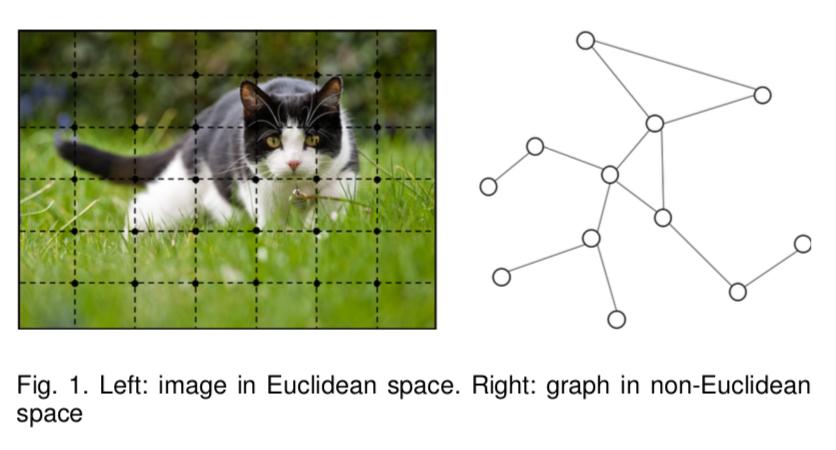
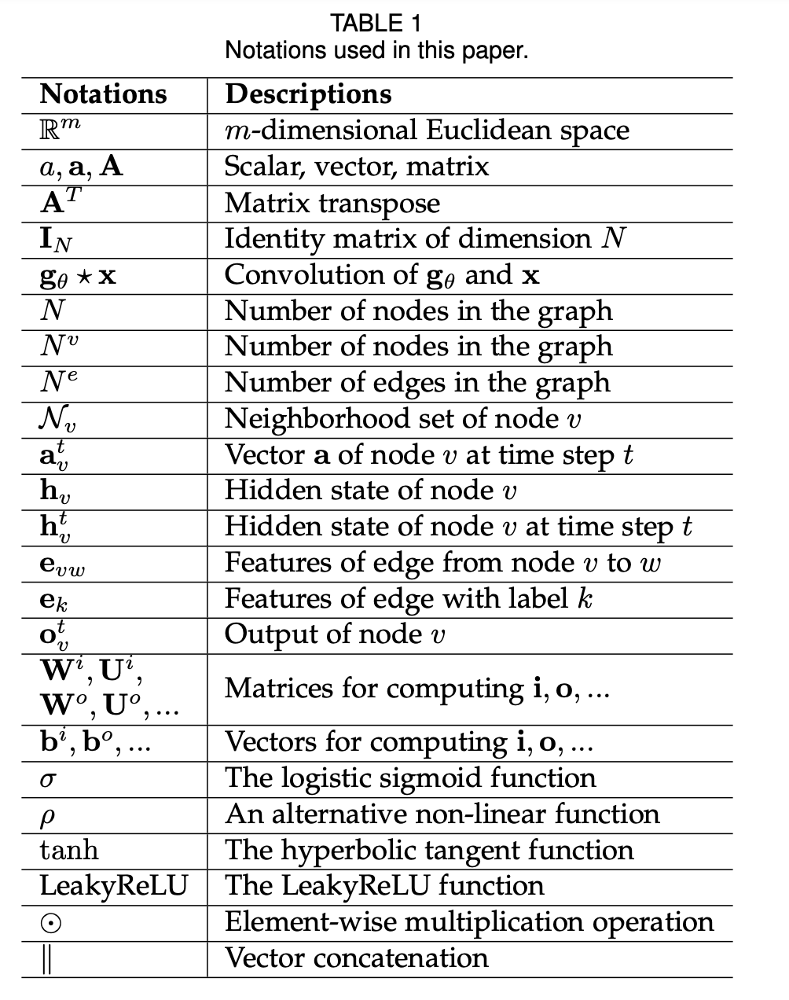
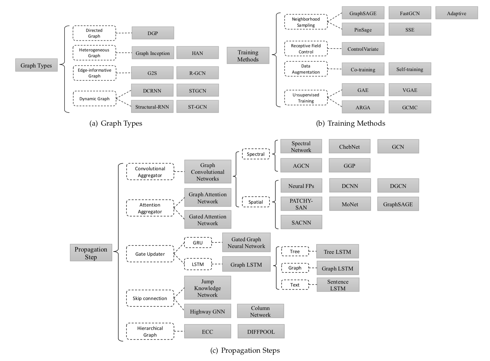

> 
Graph Neural Networks: A Review of Methods and Applications

---

​		**摘要：**大量的学习任务要求处理元素间含有丰富关系信息的图形数据。物理系统的建模、分子指纹的学习、蛋白质界面的预测和疾病的分类都需要模型从图形输入中学习。在其他领域，如文本、图像等非结构数据的学习中，提取结构的推理，如句子的依赖树和图像的场景图，是一个需要图推理模型的重要研究课题。图神经网络 (GNN) 是一种连接模型，它通过图的节点之间的消息传递来捕捉图的依赖关系。与标准神经网络不同的是，图神经网络保留了一种状态，可以表示来自其邻域的具有任意深度的信息。虽然发现原始的 GNN 很难为一个固定点进行训练，但是网络结构、优化技术和并行计算的最新进展使它们能够成功地学习。近年来，基于图卷积网络 (GCN) 和门控图神经网络 (GGNN) 的系统在上述众多任务中表现出突破性的性能。在本综述中，我们对现有的图神经网络模型进行了详细的回顾，对应用进行了系统的分类，并提出了四个有待进一步研究的问题。

---

# 1. Introduction

​		图是一种数据结构，它为一组对象（节点）及其关系（边）建模。近年来，机器学习图分析的研究越来越受到人们的重视，因为图有很强的表达能力，可以作为许多系统的外延，包括社会科学 (social networks) , 自然科学 (物理系统和蛋白质相互作用网络) , 知识图谱等许多研究领域。图分析作为一种用于机器学习的独特的==**非欧几里得数据结构**==，主要集中在节点分类、链接预测和聚类等方面。图神经网络（GNN）是在图域上运行的基于深度学习的方法。GNN 以其令人信服的性能和较高的可解释性，近年来已成为一种广泛应用的图论分析方法。在下面几段中，我们将说明图神经网络的基本动机。

​		GNNs 的第一个动机源于**卷积神经网络** (CNN)。CNN能够提取多尺度的局部空间特征并将其组合起来，构建出高度表达的表示形式，在几乎所有的机器学习领域都取得了突破，开启了深度学习的新时代。然而，CNN只能处理常规的欧几里德数据，如图像（2D 网格）和文本（1D 序列），而这些数据结构可以看作是图的实例。随着我们对CNN和图表的深入，我们发现了CNN的关键：局部连接、共享权重和多层使用。这些对解决图域问题也具有重要意义，因为：①图是最典型的局部连通结构；②与传统的谱图理论相比，共享权值降低了计算量；③多层结构是处理层次化模式的关键，它能捕获各种尺寸的特征。因此，很容易就能发现 CNN 对图形的推广。但是，如1所示，局部化的卷积滤波器和集合算子很难定义，这阻碍了CNN从欧几里得域向非欧几里得域的转化。

​		另一个动机来自**图嵌入**，它学习在低维向量中表示图节点、边或子图。在图分析领域，传统的机器学习方法通常依赖于手工设计的特征，且受其灵活性和高成本的限制。 DeepWalk 是第一个基于表示学习的图嵌入方法，它遵循表示学习的思想和词嵌入的成功，在生成的随机游动上应用了 SkipGram 模型。类似的方法如node2vec、LINE和 TADW 也取得了突破。然而，这些方法遭受两个严重的缺点。首先，编码器中的节点之间没有共享参数，这导致计算效率低下，因为这意味着参数数量随节点数量线性增长。直接嵌入法由于缺乏推广能力，不能处理动态图，也不能推广到新图。

**基于CNN和图形嵌入，图形神经网络（GNN）被提出用于对图形结构中的信息进行集合。因此，它们可以对由元素组成的输入和/或输出及其依赖性进行建模，并且图神经网络可以用RNN核同时对图上的扩散过程进行建模。**

​		在接下来的部分，我们解释了图神经网络为什么值得研究的根本原因。

- 第一，像 CNN 和 RNN 这样的标准神经网络不能正确处理图形输入，因为它们按特定的顺序堆叠节点的特征。然而，图中并没有一个自然的节点顺序。为了完整地表示一个图，我们应该像 CNN 和 RNN 一样遍历所有可能的顺序作为模型的输入，这在计算时是非常多余的。为了解决这个问题，GNN 分别在每个节点上传播，忽略节点的输入顺序。换句话说，GNNs 的输出对于节点的输入顺序是不变的。

- 第二，图中的边表示两个节点之间的依赖信息。在标准神经网络中，依赖信息仅仅作为节点的特征。然而，GNN 可以在图形结构的引导下进行传播，而不是将其作为特性的一部分。GNN 通常通过邻域状态的加权和来更新节点的隐藏状态。

- 第三，推理是高级人工智能的一个重要研究课题，人脑中的推理过程几乎都是基于从日常经验中提取的图。标准的神经网络已经显示出通过学习数据的分布来生成合成图像和文档的能力，而他们仍然不能从大量的实验数据中学习推理图。然而，GNN 探索从像场景图片和故事文档这样的非结构性数据生成图形，这可以成为进一步高级 AI 的强大神经模型。最近已经证明，一个未经训练的 GNN 与一个简单的体系结构也表现良好。

​		关于图神经网络有几个全面的综述。[18] 给出了早期图神经网络方法的正式定义。[19] 证明了图神经网络的逼近性质和计算能力。[20] 提出了一个统一的框架Monet，将CNN架构推广到非欧几里得域（图和流形），该框架可以推广图[2]、[21]上的几种光谱方法以及流形[22]、[23]上的一些模型。[24] 提供了几何深度学习的全面回顾，其中介绍了它的问题、困难、解决方案、应用和未来的方向。[20] 和 [24] 的研究重点是将卷积推广到图或流形上，但本文只关注图上定义的问题，并研究了图神经网络中的其它机制，如门机制、注意机制和跳过连接。[25] 提出了消息传递神经网络 (MPNN)，它可以推广几种图神经网络和图卷积网络的方法。给出了消息传递神经网络的定义，并演示了其在量子化学中的应用。[26]提出了非局部神经网络（NLNN），它统一了几种“自我关注”方式。然而，模型并没有在原始文件的图表上明确定义。以具体的应用领域为重点，[25] 和 [26] 只举例说明如何使用框架推广其他模型，而不提供对其他图神经网络模型的评审。[27] 提出了图网络 (GN) 框架。该框架具有很强的泛化其他模型的能力，其关系归纳偏差促进了组合泛化，被认为是 AI 的重中之重。然而，[27] 是部分立场文件，部分评审和部分统一，它只是一个粗略的分类申请。在本文中，我们提供了一个全面评审不同图形神经网络的模型以及一个系统的分类方法的应用。

​		总之，本文对具有以下贡献的图神经网络进行了广泛的综述。一、我们提供了一个详细的评审现有图形神经网络的模型。我们介绍了原始模型、它的变体和几个通用框架。我们研究了这方面的各种模型，并提供了一个统一的表示，以在不同的模型中呈现不同的传播步骤。通过识别相应的聚合器和更新器，可以很容易地使用我们的表示区分不同的模型。二、我们对应用程序进行了系统分类，并将应用程序分为结构场景、非结构场景和其他场景。我们介绍了几种主要的应用程序及其相应的方法在不同的情况。三、我们提出了四个有待进一步研究的问题。图神经网络存在过度光滑和尺度问题。目前还没有有效的方法来处理动态图以及建模非结构感知数据。我们对每一个问题都进行了透彻的分析，并提出了今后的研究方向。
​		本次调查的其余部分整理如下。第2节，我们介绍了图神经网络家族中的各种模型。我们首先介绍原始框架及其局限性。然后我们展示它的变体，试图释放这些限制。最后，我们介绍了最近提出的几个通用框架。在第3节中，我们将介绍图神经网络在结构场景、非结构场景和其他场景中的几个主要应用。在第4节中，我们提出了图神经网络的四个开放问题以及未来的研究方向。最后，我们在第5节结束了调查。

---

# 2. Models

​		在第 2.1 节中，我们描述了[18] 提出的原始图神经网络。我们还列出了原始 GNN 在表达能力和训练效率上的局限性。在 2.2 节中，我们介绍了图神经网络的几种变体，旨在释放其局限性。这些变量对不同类型的图进行操作，使用不同的传播函数和高级训练方法。在第 2.3 节中，我们提出了三个通用框架，可以推广和扩展几条工作线。具体而言，消息传递神经网络 (MPNN) [25] 将各种图神经网络和图卷积网络方法统一起来；非局部神经网络 (NLNN) [26] 将几种自我关注式方法统一起来。图网络 (GN) [27] 可以推广本文提到的几乎每个图神经网络变量。

​		在进一步进入不同的部分之前，我们给出了将在整个论文中使用的符号。符号的详细描述见表 1。

## 2.1 Graph Neural Networks

​		图神经网络 (GNN) 的概念是在 [18] 首次提出的，它扩展了现有的用于处理图域中的数据的神经网络。在一个图中，每个节点由它的特征和相关的节点自然地定义。**GNN 的目标是学习一个状态嵌入$h_v\in R^s$，其中包含每个节点的邻域信息。状态嵌入$h_{v}$是节点$v$的$s$维向量，可用于产生节点标签等输出$o_{v}$**。设$f$为参数函数，称为局部转移函数，在所有节点间共享，并根据输入邻域更新节点状态。$g$是局部输出函数，它描述了输出是如何产生的。然后，$f$和$g$定义如下：
$$
\label{eq:sim-fw}
    \mathbf{h}_v = f(\mathbf{x}_v,  \mathbf{x}_{co[v]}, \mathbf{h}_{ne[v]}, \mathbf{x}_{ne[v]})
$$

$$
\mathbf{o}_v = g(\mathbf{h}_v, \mathbf{x}_v)
$$

其中$\mathbf{x}_v, \mathbf{x}_{co[v]}, \mathbf{h}_{ne[v]}, \mathbf{x}_{ne[v]}$分别是$v$的特征、其边的特征、状态以及$v$附近节点的特征

让 $\mathbf{H}$, $\mathbf{O}$, $\mathbf{X}$, 和 $\mathbf{X}_N$ 分别是通过堆叠所有状态、所有输出、所有特征和所有节点特征构建的向量。然后我们有一个紧凑的形式：
$$
\mathbf{H} = F(\mathbf{H}, \mathbf{X}) \label{mathH}
$$

$$
\mathbf{O} = G(\mathbf{H}, \mathbf{X}_N)
$$

其中$F$是全局转换函数，$G$是全局输出函数，是图中所有节点 $f, g$函数的叠加形式。$\mathbf{H}$的值是等式$\eqref{mathH}$的固定点，并以$f$为收缩图的假设进行了独特的定义。$\mathbf{H}$的值是由等式$\eqref{mathH}$确定的，并且假设$F$是收缩图，$\mathbf{H}$的值被唯一定义。

​		在 Banach 不动点定理 [28] 的建议下，GNN 使用以下经典迭代方案计算状态：
$$
\mathbf{H}^{t+1} = F(\mathbf{H}^{t}, \mathbf{X})\label{eqiter}
$$
式中的$\mathbf{H}^{t}$表示$\mathbf{H}$的第$t$次迭代. 对于任何初始值$\mathbf{H}(0)$，动态方程$\eqref{eqiter}$以指数形式快速收敛到方程$\eqref{mathH}$的解。注意，$F$ 和$G$ 中描述的计算可以解释为前馈神经网络。

​		当我们有GNN的框架时，下一个问题是如何学习$f$和$g$的参数。利用目标信息（特定节点$t_v$）进行监督，损失可以写如下：
$$
loss = \sum_{i=1}^p(t_i-o_i)
$$
其中$p$是监督节点的数量。学习算法基于梯度下降策略，由以下步骤组成：

- 状态$h_v^t$由式$\eqref{eq:sim-fw}$迭代更新到时间 ，它们接近式$\eqref{mathH}$的定点解：
- 权重$W$的梯度由损失计算得出；
- 根据上一步计算的梯度更新权重$W$。

​		Limitations  虽然实验结果表明，GNN是一种强大的结构数据建模体系结构，但原始GNN仍然存在一些局限性。**首先**，对于固定点迭代更新节点的隐藏状态是低效的。如果放宽固定点的假设，我们可以设计一个多层GNN，以得到节点及其邻域的稳定表示。**其次**，GNN在迭代中使用相同的参数，而大多数流行的神经网络在不同的层中使用不同的参数，这是一种分层特征提取方法。此外，节点隐藏状态的更新是一个顺序过程，可以从RNN内核（如GRU和LSTM）中获益。**第三**，边上也存在一些信息性特征，这些特征在原始GNN中无法有效建模。例如，知识图中的边具有关系类型，通过不同边的消息传播应根据它们的类型而有所不同。**此外**，如何了解边的隐藏状态也是一个重要的问题。**最后**，如果我们把重点放在节点的表示上而不是图上，就不适合使用固定点，因为固定点上的表示分布在数值上是平滑的，区分每个节点的信息量也比较少。

## 2.2 Variants of Graph Neural Networks

​		在本节中，我们介绍了图神经网络的几种变体。第2.2.1节重点介绍在不同图类型上操作的变体。这些变体扩展了原始模型的表示能力。第2.2.2节列出了传播步骤的几种模式（卷积、门机制、注意机制和跳跃连接），这些模型可以学习更高质量的表示。第2.2.3节介绍了使用高级培训方法的变体，这些方法可提高培训效率。图2概述了图神经网络的不同变体。

An overview of variants of graph neural networks

### 2.2.1 Graph Types

在原GNN[18]中，输入图由带标签信息的节点和无向边组成，这是最简单的图格式。然而，世界上有许多图形变体。在本小节中，我们将介绍一些设计用于对不同类型的图进行建模的方法。

​		**Directed Graphs **图的第一个变种是有向图。无向边可以看作是两个有向边，这表明两个节点之间存在一种关系。然而，有向边比无向边能带来更多的信息。例如，在一个知识图中，边从头部实体开始到尾部实体结束，头部实体是尾部实体的父类，这意味着我们应该区别对待父类和子类的信息传播过程。ADGPM[29]使用了两种权重矩阵，$W_p$和$W_c$，以合并更精确的结构信息。传播规则如下：
$$
\mathbf{H}^{t} = \sigma(\mathbf{D}^{-1}_p\mathbf{A}_p\sigma(\mathbf{D}^{-1}_c\mathbf{A}_c\mathbf{H}^{t-1}\mathbf{W}_c)\mathbf{W}_p)
$$
其中，$\mathbf{D}^{-1}_p\mathbf{A}_p$, $\mathbf{D}^{-1}_c\mathbf{A}_c$分别是父代和子代的标准化邻接矩阵。

​		**Heterogeneous Graphs** 图的第二个变种是异构图，其中有几种节点。处理异构图的最简单方法是将每个节点的类型转换为一个与原始特征连接的one-hot特征向量。此外，GraphInception[30] 将 metapath 的概念引入到异构图的传播中。使用metapath，我们可以根据相邻节点的类型和距离对其进行分组。对于每个相邻组，GraphInception 将其视为同构图中的一个子图进行传播，并将来自不同同构图的传播结果连接起来以进行集体的节点表示。

​		**Graph with Edge Information** 在图形的另一种变体中，每个边还具有诸如边的权重或类型等信息。处理这种图有两种方法：首先，我们可以将图转换为二分图，其中原始边也成为节点，并且将一个原始边拆分为两个新边，这意味着边节点和开始/结束节点之间有两个新边。G2S[31]的编码器对邻域使用以下聚合函数：
$$
\mathbf{h}_v^t = \rho (\frac 1 {|\mathcal{N}_v|}\sum_{u \in \mathcal{N}_v} \mathbf{W}_{r}(\mathbf{r}_v^t \odot \mathbf{h}_u^{t-1}) + \mathbf{b}_{r})
$$
其中，$\mathbf{W}_{r}$ 和 $\mathbf{b}_{r}$是不同类型边（关系）的传播参数。其次，我们可以调整不同的权重矩阵，使其在不同的边上传播。当关系数（不同类型边数量）很大时，r-GCN[32] 引入两种正则化方法来减少关系建模的参数：基对角分解和块对角分解，通过基分解，每个$\mathbf{W}_{r}$定义如下：
$$
\textbf{W}_r = \sum_1^B a_{rb} \mathbf{V}_b
$$
也就是说，$\mathbf{W}_{r}$作为基变换$\mathbf{V}_b \in \mathbb{R}^{d_{in} \times d_{out}}$与系数$a_{rb}$的线性组合，只有系数依赖于$r$。在块对角分解中，r-GCN 通过对一组低维矩阵的直接求和来定义每个$\mathbf{W}_{r}$，这比第一个矩阵需要更多的参数。、

​		**Dynamic Graphs** 图另一种变体是动态图，图具有静态的结构以及动态的输入信号。 为了捕获这两种不同的信息， DCRNN[40] 和 STGCN[41] 首先通过GNN聚合空间结构信息, 然后把输出输入到序列模型，例如seq2seq或者CNNs. 不同的是, Structural-RNN[41] 和 ST-GCN[43] 同时聚合空间和临时的信息，他们扩展到带有瞬时连接的静态图结构，从而可以应用到传统的GNNs。

