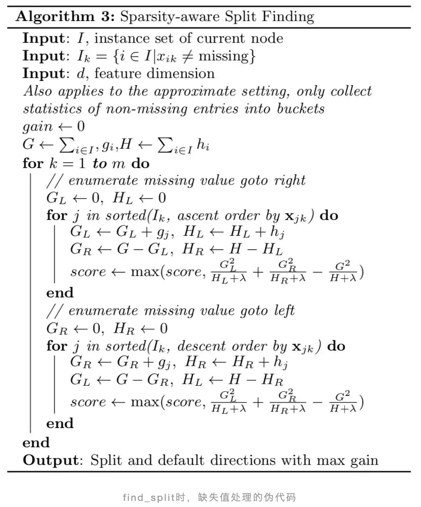
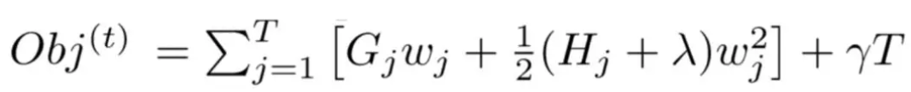
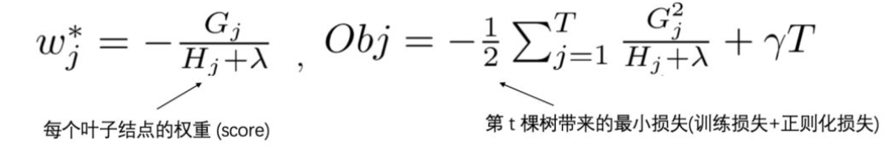

> XGBoost的威名想必大家都有所耳闻，它不仅是数据科学竞赛神器，在工业界中也被广泛地使用。本文给大家分享珍藏了多年的XGBoost高频面试题，希望能够加深大家对XGBoost的理解，更重要的是能够在找机会时提供一些帮助。

### 1. 简单介绍一下XGBoost 

首先需要说一说GBDT，它是一种基于boosting增强策略的加法模型，训练的时候采用前向分布算法进行贪婪的学习，每次迭代都学习一棵CART树来拟合之前 t-1 棵树的预测结果与训练样本真实值的残差。

XGBoost对GBDT进行了一系列优化，比如损失函数进行了二阶泰勒展开、目标函数加入正则项、支持并行和默认缺失值处理等，在可扩展性和训练速度上有了巨大的提升，但其核心思想没有大的变化。

### 2. XGBoost与GBDT有什么不同

- **基分类器**：XGBoost的基分类器不仅支持CART决策树，还支持线性分类器，此时XGBoost相当于带L1和L2正则化项的Logistic回归（分类问题）或者线性回归（回归问题）。
- **导数信息**：XGBoost对损失函数做了二阶泰勒展开，GBDT只用了一阶导数信息，并且XGBoost还支持自定义损失函数，只要损失函数一阶、二阶可导。
- **正则项**：XGBoost的目标函数加了正则项， 相当于预剪枝，使得学习出来的模型更加不容易过拟合。
- **列抽样**：XGBoost支持列采样，与随机森林类似，用于防止过拟合。
- **缺失值处理**：对树中的每个非叶子结点，XGBoost可以自动学习出它的默认分裂方向。如果某个样本该特征值缺失，会将其划入默认分支。
- **并行化**：注意不是tree维度的并行，而是特征维度的并行。XGBoost预先将每个特征按特征值排好序，存储为块结构，分裂结点时可以采用多线程并行查找每个特征的最佳分割点，极大提升训练速度。

### 3. XGBoost为什么使用泰勒二阶展开

- **精准性**：相对于GBDT的一阶泰勒展开，XGBoost采用二阶泰勒展开，可以更为精准的逼近真实的损失函数
- **可扩展性**：损失函数支持自定义，只需要新的损失函数二阶可导。

### 4. XGBoost为什么可以并行训练

- XGBoost的并行，并不是说每棵树可以并行训练，XGB本质上仍然采用boosting思想，每棵树训练前需要等前面的树训练完成才能开始训练。
- XGBoost的并行，指的是特征维度的并行：在训练之前，每个特征按特征值对样本进行预排序，并存储为Block结构，在后面查找特征分割点时可以重复使用，而且特征已经被存储为一个个block结构，那么在寻找每个特征的最佳分割点时，可以利用多线程对每个block并行计算。

### 5. XGBoost为什么快

- **分块并行**：训练前每个特征按特征值进行排序并存储为Block结构，后面查找特征分割点时重复使用，并且支持并行查找每个特征的分割点
- **候选分位点**：每个特征采用常数个分位点作为候选分割点
- **CPU cache 命中优化**： 使用缓存预取的方法，对每个线程分配一个连续的buffer，读取每个block中样本的梯度信息并存入连续的Buffer中。
- **Block 处理优化**：Block预先放入内存；Block按列进行解压缩；将Block划分到不同硬盘来提高吞吐

### 6. XGBoost防止过拟合的方法

XGBoost在设计时，为了防止过拟合做了很多优化，具体如下：

- **目标函数添加正则项**：叶子节点个数+叶子节点权重的L2正则化
- **列抽样**：训练的时候只用一部分特征（不考虑剩余的block块即可）
- **子采样**：每轮计算可以不使用全部样本，使算法更加保守
- **shrinkage**: 可以叫学习率或步长，为了给后面的训练留出更多的学习空间

### 7. XGBoost如何处理缺失值

XGBoost模型的一个优点就是允许特征存在缺失值。对缺失值的处理方式如下：

- 在特征k上寻找最佳 split point 时，不会对该列特征 missing 的样本进行遍历，而只对该列特征值为 non-missing 的样本上对应的特征值进行遍历，通过这个技巧来减少了为稀疏离散特征寻找 split point 的时间开销。
- 在逻辑实现上，为了保证完备性，会将该特征值missing的样本分别分配到左叶子结点和右叶子结点，两种情形都计算一遍后，选择分裂后增益最大的那个方向（左分支或是右分支），作为预测时特征值缺失样本的默认分支方向。
- 如果在训练中没有缺失值而在预测中出现缺失，那么会自动将缺失值的划分方向放到右子结点。

### 8. XGBoost中叶子结点的权重如何计算出来

XGBoost目标函数最终推导形式如下：

利用一元二次函数求最值的知识，当目标函数达到最小值Obj*时，每个叶子结点的权重为wj*。

具体公式如下：

### 9. XGBoost中的一棵树的停止生长条件

- 当新引入的一次分裂所带来的增益Gain<0时，放弃当前的分裂。这是训练损失和模型结构复杂度的博弈过程。
- 当树达到最大深度时，停止建树，因为树的深度太深容易出现过拟合，这里需要设置一个超参数max_depth。
- 当引入一次分裂后，重新计算新生成的左、右两个叶子结点的样本权重和。如果任一个叶子结点的样本权重低于某一个阈值，也会放弃此次分裂。这涉及到一个超参数:最小样本权重和，是指如果一个叶子节点包含的样本数量太少也会放弃分裂，防止树分的太细。

### 10. RF和GBDT的区别

**相同点：**

- 都是由多棵树组成，最终的结果都是由多棵树一起决定。

**不同点：**

- **集成学习**：RF属于bagging思想，而GBDT是boosting思想
- **偏差-方差权衡**：RF不断的降低模型的方差，而GBDT不断的降低模型的偏差
- **训练样本**：RF每次迭代的样本是从全部训练集中有放回抽样形成的，而GBDT每次使用全部样本
- **并行性**：RF的树可以并行生成，而GBDT只能顺序生成(需要等上一棵树完全生成)
- **最终结果**：RF最终是多棵树进行多数表决（回归问题是取平均），而GBDT是加权融合
- **数据敏感性**：RF对异常值不敏感，而GBDT对异常值比较敏感
- **泛化能力**：RF不易过拟合，而GBDT容易过拟合

