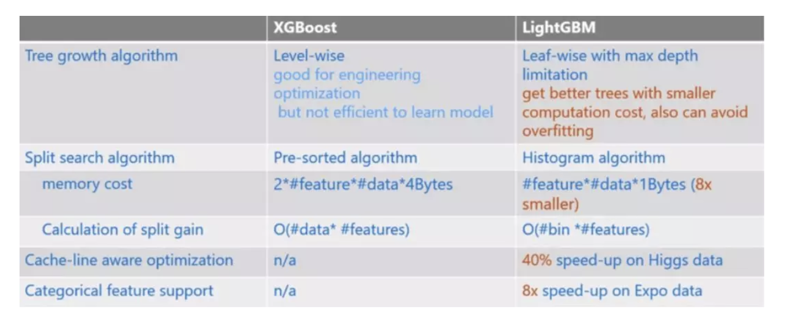

> XGBoost的威名想必大家都有所耳闻，它不仅是数据科学竞赛神器，在工业界中也被广泛地使用。本文给大家分享珍藏许久的XGBoost高频面试题，希望能够加深大家对XGBoost的理解，更重要的是能够在找机会时提供一些帮助。


### 1. XGBoost如何处理不平衡数据

对于不平衡的数据集，例如用户的购买行为，肯定是极其不平衡的，这对XGBoost的训练有很大的影响，XGBoost有两种自带的方法来解决：

第一种，如果你在意AUC，采用AUC来评估模型的性能，那你可以通过设置scale_pos_weight来平衡正样本和负样本的权重。例如，当正负样本比例为1:10时，scale_pos_weight可以取10；

第二种，如果你在意概率(预测得分的合理性)，你不能重新平衡数据集(会破坏数据的真实分布)，应该设置max_delta_step为一个有限数字来帮助收敛（基模型为LR时有效）。

原话是这么说的：

```
For common cases such as ads clickthrough log, the dataset is extremely imbalanced. This can affect the training of xgboost model, 
and there are two ways to improve it.
  If you care only about the ranking order (AUC) of your prediction
      Balance the positive and negative weights, via scale_pos_weight
      Use AUC for evaluation
  If you care about predicting the right probability
      In such a case, you cannot re-balance the dataset
      In such a case, set parameter max_delta_step to a finite number (say 1) will help convergence
```

那么，源码到底是怎么利用**scale_pos_weight**来平衡样本的呢，是调节权重还是过采样呢？请看源码：

```
if (info.labels[i] == 1.0f)  w *= param_.scale_pos_weight
```

可以看出，应该是增大了少数样本的权重。

除此之外，还可以通过上采样、下采样、SMOTE算法或者自定义代价函数的方式解决正负样本不平衡的问题。


### 2. 比较LR和GBDT，说说什么情景下GBDT不如LR

先说说LR和GBDT的区别：

- LR是线性模型，可解释性强，很容易并行化，但学习能力有限，需要大量的人工特征工程
- GBDT是非线性模型，具有天然的特征组合优势，特征表达能力强，但是树与树之间无法并行训练，而且树模型很容易过拟合；

当在高维稀疏特征的场景下，LR的效果一般会比GBDT好。原因如下：

先看一个例子：

> 假设一个二分类问题，label为0和1，特征有100维，如果有1w个样本，但其中只要10个正样本1，而这些样本的特征 f1的值为全为1，而其余9990条样本的f1特征都为0(在高维稀疏的情况下这种情况很常见)。
>
> 我们都知道在这种情况下，树模型很容易优化出一个使用f1特征作为重要分裂节点的树，因为这个结点直接能够将训练数据划分的很好，但是当测试的时候，却会发现效果很差，因为这个特征f1只是刚好偶然间跟y拟合到了这个规律，这也是我们常说的过拟合。

那么这种情况下，如果采用LR的话，应该也会出现类似过拟合的情况呀：y = W1*f1 + Wi*fi+….，其中 W1特别大以拟合这10个样本。为什么此时树模型就过拟合的更严重呢？

==仔细想想发现，因为现在的模型普遍都会带着正则项，而 LR 等线性模型的正则项是对权重的惩罚，也就是 W1一旦过大，惩罚就会很大，进一步压缩 W1的值，使他不至于过大。但是，树模型则不一样，树模型的惩罚项通常为叶子节点数和深度等，而我们都知道，对于上面这种 case，树只需要一个节点就可以完美分割9990和10个样本，一个结点，最终产生的惩罚项极其之小。==

这也就是为什么在高维稀疏特征的时候，线性模型会比非线性模型好的原因了：**带正则化的线性模型比较不容易对稀疏特征过拟合。**


### 3. XGBoost中如何对树进行剪枝

- 在目标函数中增加了正则项：使用叶子结点的数目和叶子结点权重的L2模的平方，控制树的复杂度。
- 在结点分裂时，定义了一个阈值，如果分裂后目标函数的增益小于该阈值，则不分裂。
- 当引入一次分裂后，重新计算新生成的左、右两个叶子结点的样本权重和。如果任一个叶子结点的样本权重低于某一个阈值（最小样本权重和），也会放弃此次分裂。
- XGBoost 先从顶到底建立树直到最大深度，再从底到顶反向检查是否有不满足分裂条件的结点，进行剪枝。


### 4. XGBoost如何选择最佳分裂点？ 

XGBoost在训练前预先将特征按照特征值进行了排序，并存储为block结构，以后在结点分裂时可以重复使用该结构。

因此，可以采用特征并行的方法利用多个线程分别计算每个特征的最佳分割点，根据每次分裂后产生的增益，最终选择增益最大的那个特征的特征值作为最佳分裂点。

如果在计算每个特征的最佳分割点时，对每个样本都进行遍历，计算复杂度会很大，这种全局扫描的方法并不适用大数据的场景。XGBoost还提供了一种直方图近似算法，对特征排序后仅选择常数个候选分裂位置作为候选分裂点，极大提升了结点分裂时的计算效率。


### 5. XGBoost的Scalable性如何体现

- **基分类器的scalability**：弱分类器可以支持CART决策树，也可以支持LR和Linear。
- **目标函数的scalability**：支持自定义loss function，只需要其一阶、二阶可导。有这个特性是因为泰勒二阶展开，得到通用的目标函数形式。
- **学习方法的scalability**：Block结构支持并行化，支持 Out-of-core计算。


### 6. XGBoost如何评价特征的重要性

我们采用三种方法来评判XGBoost模型中特征的重要程度：


```
 官方文档：
（1）weight - the number of times a feature is used to split the data across all trees. （2）gain - the average gain of the feature when it is used in trees. 
（3）cover - the average coverage of the feature when it is used in trees.
```

- **weight** ：该特征在所有树中被用作分割样本的特征的总次数。
- **gain** ：该特征在其出现过的所有树中产生的平均增益。
- **cover** ：该特征在其出现过的所有树中的平均覆盖范围。

> ==注意：覆盖范围这里指的是一个特征用作分割点后，其影响的样本数量，即有多少样本经过该特征分割到两个子节点。==


### 7. XGBooost参数调优的一般步骤

首先需要初始化一些基本变量，例如：

- max_depth = 5
- min_child_weight = 1
- gamma = 0
- subsample, colsample_bytree = 0.8
- scale_pos_weight = 1

**(1) 确定learning rate和estimator的数量**

learning rate可以先用0.1，用cv来寻找最优的estimators

**(2) max_depth和 min_child_weight**

我们调整这两个参数是因为，这两个参数对输出结果的影响很大。我们首先将这两个参数设置为较大的数，然后通过迭代的方式不断修正，缩小范围。

max_depth，每棵子树的最大深度，check from range(3,10,2)。

min_child_weight，子节点的权重阈值，check from range(1,6,2)。

如果一个结点分裂后，它的所有子节点的权重之和都大于该阈值，该叶子节点才可以划分。

**(3) gamma**

也称作最小划分损失`min_split_loss`，check from 0.1 to 0.5，指的是，对于一个叶子节点，当对它采取划分之后，损失函数的降低值的阈值。

- 如果大于该阈值，则该叶子节点值得继续划分
- 如果小于该阈值，则该叶子节点不值得继续划分

**(4) subsample, colsample_bytree**

subsample是对训练的采样比例

colsample_bytree是对特征的采样比例

both check from 0.6 to 0.9

**(5) 正则化参数**

alpha 是L1正则化系数，try 1e-5, 1e-2, 0.1, 1, 100

lambda 是L2正则化系数

**(6) 降低学习率**

降低学习率的同时增加树的数量，通常最后设置学习率为0.01~0.1


### 8. XGBoost模型如果过拟合了怎么解决

当出现过拟合时，有两类参数可以缓解：

- 第一类参数：==用于直接控制模型的复杂度==。包括`max_depth,min_child_weight,gamma` 等参数

- 第二类参数：==用于增加随机性，从而使得模型在训练时对于噪音不敏感==。包括`subsample,colsample_bytree`

还有就是直接减小`learning rate`，但需要同时增加`estimator` 参数。


### 9.为什么XGBoost相比某些模型对缺失值不敏感

对存在缺失值的特征，一般的解决方法是：

- 离散型变量：用出现次数最多的特征值填充；
- 连续型变量：用中位数或均值填充；

一些模型如SVM和KNN，其模型原理中涉及到了对样本距离的度量，如果缺失值处理不当，最终会导致模型预测效果很差。

而树模型对缺失值的敏感度低，大部分时候可以在数据缺失时时使用。原因就是，一棵树中每个结点在分裂时，寻找的是某个特征的最佳分裂点（特征值），完全可以不考虑存在特征值缺失的样本，也就是说，如果某些样本缺失的特征值缺失，对寻找最佳分割点的影响不是很大。

XGBoost对缺失数据有特定的处理方法，[详情参考上篇文章第7题](http://mp.weixin.qq.com/s?__biz=Mzg2MjI5Mzk0MA==&mid=2247484181&idx=1&sn=8d0e51fb0cb974f042e66659e1daf447&chksm=ce0b59cef97cd0d8cf7f9ae1e91e41017ff6d4c4b43a4c19b476c0b6d37f15769f954c2965ef&scene=21#wechat_redirect)。

因此，对于有缺失值的数据在经过缺失处理后：

- 当数据量很小时，优先用朴素贝叶斯
- 数据量适中或者较大，用树模型，优先XGBoost
- 数据量较大，也可以用神经网络
- 避免使用距离度量相关的模型，如KNN和SVM


### 10. XGBoost和LightGBM的区别



（1）树生长策略：XGB采用`level-wise`的分裂策略，LGB采用`leaf-wise`的分裂策略。XGB对每一层所有节点做无差别分裂，但是可能有些节点增益非常小，对结果影响不大，带来不必要的开销。Leaf-wise是在所有叶子节点中选取分裂收益最大的节点进行的，但是很容易出现过拟合问题，所以需要对最大深度做限制 。

（2）分割点查找算法：XGB使用特征预排序算法，LGB使用基于直方图的切分点算法，其优势如下：

- 减少内存占用，比如离散为256个bin时，只需要用8位整形就可以保存一个样本被映射为哪个bin(这个bin可以说就是转换后的特征)，对比预排序的exact greedy算法来说（用int_32来存储索引+ 用float_32保存特征值），可以节省7/8的空间。
- 计算效率提高，预排序的Exact greedy对每个特征都需要遍历一遍数据，并计算增益，复杂度为𝑂(#𝑓𝑒𝑎𝑡𝑢𝑟𝑒×#𝑑𝑎𝑡𝑎)。而直方图算法在建立完直方图后，只需要对每个特征遍历直方图即可，复杂度为𝑂(#𝑓𝑒𝑎𝑡𝑢𝑟𝑒×#𝑏𝑖𝑛𝑠)。
- LGB还可以使用直方图做差加速，一个节点的直方图可以通过父节点的直方图减去兄弟节点的直方图得到，从而加速计算

> 但实际上xgboost的近似直方图算法也类似于lightgbm这里的直方图算法，为什么xgboost的近似算法比lightgbm还是慢很多呢？
>
> xgboost在每一层都动态构建直方图， 因为xgboost的直方图算法不是针对某个特定的feature，而是所有feature共享一个直方图(每个样本的权重是二阶导)，所以每一层都要重新构建直方图，而lightgbm中对每个特征都有一个直方图，所以构建一次直方图就够了。

（3）支持离散变量：无法直接输入类别型变量，因此需要事先对类别型变量进行编码（例如独热编码），而LightGBM可以直接处理类别型变量。

（4）缓存命中率：XGB使用Block结构的一个缺点是取梯度的时候，是通过索引来获取的，而这些梯度的获取顺序是按照特征的大小顺序的，这将导致非连续的内存访问，可能使得CPU cache缓存命中率低，从而影响算法效率。而LGB是基于直方图分裂特征的，梯度信息都存储在一个个bin中，所以访问梯度是连续的，缓存命中率高。

（5）LightGBM 与 XGboost 的并行策略不同：

- **特征并行** ：LGB特征并行的前提是每个worker留有一份完整的数据集，但是每个worker仅在特征子集上进行最佳切分点的寻找；worker之间需要相互通信，通过比对损失来确定最佳切分点；然后将这个最佳切分点的位置进行全局广播，每个worker进行切分即可。XGB的特征并行与LGB的最大不同在于XGB每个worker节点中仅有部分的列数据，也就是垂直切分，每个worker寻找局部最佳切分点，worker之间相互通信，然后在具有最佳切分点的worker上进行节点分裂，再由这个节点广播一下被切分到左右节点的样本索引号，其他worker才能开始分裂。二者的区别就导致了LGB中worker间通信成本明显降低，只需通信一个特征分裂点即可，而XGB中要广播样本索引。

- **数据并行** ：当数据量很大，特征相对较少时，可采用数据并行策略。LGB中先对数据水平切分，每个worker上的数据先建立起局部的直方图，然后合并成全局的直方图，采用直方图相减的方式，先计算样本量少的节点的样本索引，然后直接相减得到另一子节点的样本索引，这个直方图算法使得worker间的通信成本降低一倍，因为只用通信以此样本量少的节点。XGB中的数据并行也是水平切分，然后单个worker建立局部直方图，再合并为全局，不同在于根据全局直方图进行各个worker上的节点分裂时会单独计算子节点的样本索引，因此效率贼慢，每个worker间的通信量也就变得很大。

- **投票并行（LGB）**：当数据量和维度都很大时，选用投票并行，该方法是数据并行的一个改进。数据并行中的合并直方图的代价相对较大，尤其是当特征维度很大时。大致思想是：每个worker首先会找到本地的一些优秀的特征，然后进行全局投票，根据投票结果，选择top的特征进行直方图的合并，再寻求全局的最优分割点。

  

> 参考：
>
> 1.https://blog.csdn.net/u010665216/article/details/78532619
>
> 2.https://blog.csdn.net/jamexfx/article/details/93780308


