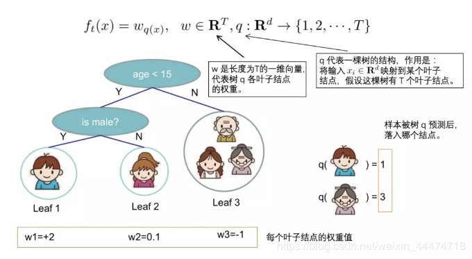
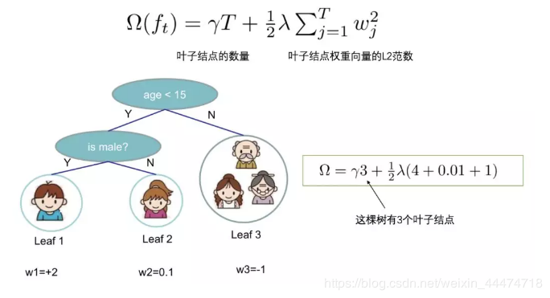
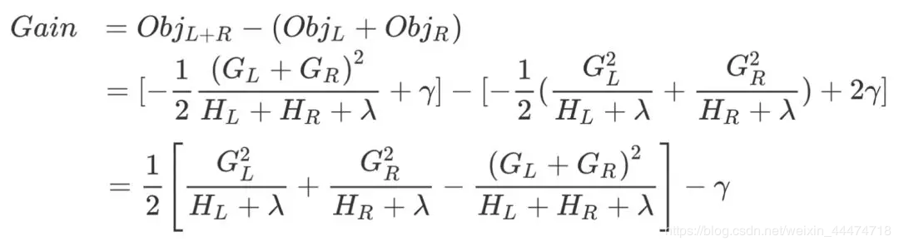
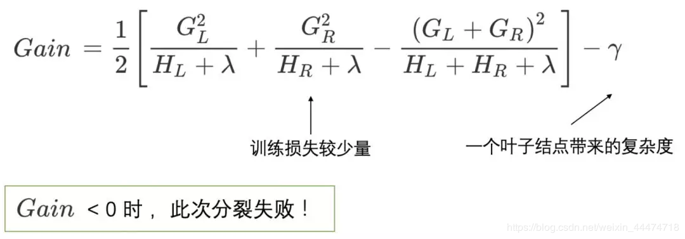
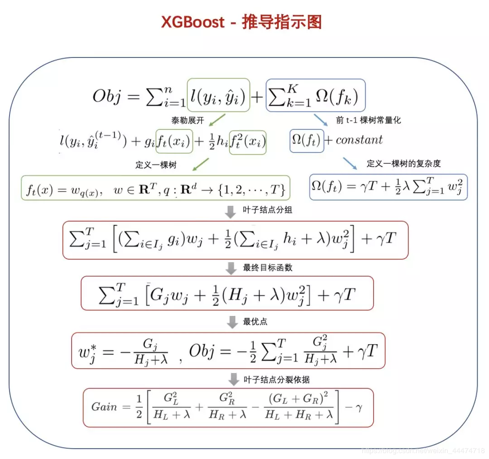

##### XGBoost论文原文：（2016.03）[XGBoost: A Scalable Tree Boosting System](https://arxiv.org/abs/1603.02754)【[代码](https://github.com/dmlc/xgboost)】

## ?XGBoost定义一颗树：

我们重新定义一颗树，包括两个部分：

- 叶子结点的权重向量ω；
- 实例 -> 叶子结点的映射关系q（本质是树的分支结构）；

一棵树的表达形式定义如下：

## ?XGBoost树的复杂度的定义：

定义一颗树的复杂度 Ω，它由两部分组成：

- 叶子结点的数量；
- 叶子结点权重向量的L2范数；

## ?XGBoost分裂一个结点：

在实际训练过程中，当建立第 t 棵树时，XGBoost采用贪心法进行树结点的分裂：

从树深为0时开始：

- 对树中的**每个叶子结点尝试**进行分裂；
- 每次分裂后，原来的一个叶子结点继续分裂为左右两个子叶子结点，原叶子结点中的样本集将根据该结点的判断规则分散到左右两个叶子结点中；
- 新分裂一个结点后，我们需要检测这次分裂**是否会给损失函数带来增益**，增益的定义如下：

**如果增益Gain>0，即分裂为两个叶子节点后，目标函数下降了，那么我们会考虑此次分裂的结果。**

但是，在一个结点分裂时，可能有很多个分裂点，每个分裂点都会产生一个增益，如何才能寻找到最优的分裂点呢？接下来会讲到。

## ?XGBoost寻找最佳分裂点：

在分裂一个结点时，我们会有很多个候选分割点，寻找最佳分割点的大致步骤如下：

- **遍历**每个结点的每个特征；
- 对每个特征，按特征值大小将特征值**排序**；
- 线性**扫描**，找出每个特征的最佳分裂特征值；
- 在所有特征中找出最好的分裂点（分裂后**增益最大**的特征及特征值）

上面是一种**贪心**的方法，每次进行分裂尝试都要遍历一遍全部候选分割点，也叫做**全局扫描法**。

但当**数据量过大导致内存无法一次载入或者在分布式情况下，贪心算法的效率就会变得很低，全局扫描法不再适用**。

基于此，XGBoost提出了一系列加快寻找最佳分裂点的方案：

- ==特征预排序+缓存==：XGBoost在训练之前，预先对每个特征按照特征值大小进行排序，然后保存为**block结构**，后面的迭代中会重复地使用这个结构，使计算量大大减小。
- ==分位点近似法==：对每个特征按照特征值排序后，采用**类似分位点选取的方式**，仅仅选出常数个特征值作为该特征的候选分割点，在寻找该特征的最佳分割点时，从候选分割点中选出最优的一个。
- ==并行查找==：由于各个特性已预先存储为block结构，XGBoost支持**利用多个线程并行地计算**每个特征的最佳分割点，这不仅大大提升了结点的分裂速度，也极利于大规模训练集的适应性扩展。

## ?XGBoost停止生长的条件：

(1) 当新引入的一次分裂所带来的增益Gain<0时，放弃当前的分裂。这是训练损失和模型结构复杂度的博弈过程。

(2) 当树达到最大深度时，停止建树，因为**树的深度太深容易出现过拟合**，这里需要设置一个超参数max_depth。

(3) 当引入一次分裂后，重新计算新生成的左、右两个叶子结点的样本权重和。如果任一个叶子结点的样本权重低于某一个阈值，也会放弃此次分裂。这涉及到一个超参数:最小样本权重和，**是指如果一个叶子节点包含的样本数量太少也会放弃分裂，防止树分的太细，这也是过拟合的一种措施**。

每个叶子结点的样本权值和计算方式如下：

$$w_j^* = -\frac{G_i}{H_j+\lambda}$$

## ?XGBoost推导指示图：

##### XGBoost面试常见问题总结：

- XGB中树结点分裂的依据是什么？
- 如何计算树节点的权值？
- 为防止过拟合，XGB做了哪些改进？
- XGB与GBDT、随机森林等模型相比，有什么优缺点？
- XGB为什么可以并行训练？
- XGB用二阶泰勒展开的优势在哪？
- XGB为了防止过拟合，进行了哪些设计？
- XGB如何处理缺失值？
- XGB如何分裂一个结点？如何选择特征？
- XGB中一颗树停止生长的条件有哪些？
- XGB叶子结点的权重有什么含义？如何计算？
- 训练一个XGB模型，经历了哪些过程？调参步骤是什么？
- XGB如何给特征评分？

