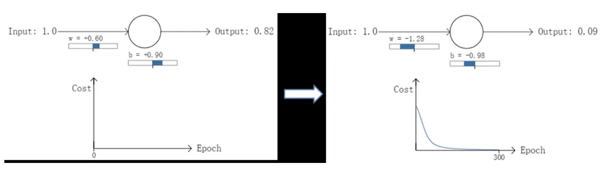

> 交叉熵代价函数（Cross-entropy cost function）是用来衡量人工神经网络（ANN）的预测值与实际值的一种方式。与二次代价函数相比，它能更有效地促进ANN的训练。在介绍交叉熵代价函数之前，本文先简要介绍二次代价函数，以及其存在的不足。

# 1、二次代价函数的不足

ANN的设计目的之一是为了使机器可以像人一样学习知识。人在学习分析新事物时，当发现自己犯的错误越大时，改正的力度就越大。比如投篮：当运动员发现自己的投篮方向离正确方向越远，那么他调整的投篮角度就应该越大，篮球就更容易投进篮筐。同理，我们希望：ANN在训练时，如果预测值与实际值的误差越大，那么在反向传播训练的过程中，各种参数调整的幅度就要更大，从而使训练更快收敛。然而，如果使用二次代价函数训练ANN，看到的实际效果是，如果误差越大，参数调整的幅度可能更小，训练更缓慢。

以一个神经元的二类分类训练为例，进行两次实验（ANN常用的激活函数为sigmoid函数，该实验也采用该函数）：输入一个相同的样本数据x=1.0（该样本对应的实际分类y=0）；两次实验各自随机初始化参数，从而在各自的第一次前向传播后得到不同的输出值，形成不同的代价（误差）：

实验1：第一次输出值为0.82

实验2：第一次输出值为0.98
 在实验1中，随机初始化参数，使得第一次输出值为0.82（该样本对应的实际值为0）；经过300次迭代训练后，输出值由0.82降到0.09，逼近实际值。而在实验2中，第一次输出值为0.98，同样经过300迭代训练，输出值只降到了0.20。

从两次实验的代价曲线中可以看出：实验1的代价随着训练次数增加而快速降低，但实验2的代价在一开始下降得非常缓慢；直观上看，初始的误差越大，收敛得越缓慢。

其实，误差大导致训练缓慢的原因在于使用了二次代价函数。二次代价函数的公式如下：

​															$C=\frac{1}{2n}\sum_x ||y(x)-a(x)||^2$

其中，$C$表示代价，$x$表示样本, $y$表示真实值，$a$表示输出值，$n$表示样本总量。为了简单起见，以单个样本为例，此时二次代价函数为：$C=\frac{(y-a)^2}{2}$

如图所示，实验2的初始输出值（0.98）对应的梯度明显小于实验1的输出值（0.82），因此实验2的参数梯度下降得比实验1慢。这就是初始的代价（误差）越大，导致训练越慢的原因。与我们的期望不符，即：不能像人一样，错误越大，改正的幅度越大，从而学习得越快。

可能有人会说，那就选择一个梯度不变化或变化不明显的激活函数不就解决问题了吗？图样图森破，那样虽然简单粗暴地解决了这个问题，但可能会引起其他更多更麻烦的问题。而且，类似sigmoid这样的函数（比如tanh函数）有很多优点，非常适合用来做激活函数，具体请自行google之

# 2、交叉熵损失函数的数学原理

说起交叉熵损失函数「Cross Entropy Loss」，脑海中立马浮现出它的公式：

$L=-[y\log\hat{y}+(1-y)\log(1-\hat{y})]$

我们已经对这个交叉熵函数非常熟悉，大多数情况下都是直接拿来使用就好。但是它是怎么来的？为什么它能表征真实样本标签和预测概率之间的差值？上面的交叉熵函数是否有其它变种？也许很多朋友还不是很清楚！没关系，接下来我将尽可能以最通俗的语言回答上面这几个问题。

我们知道，在二分类问题模型：例如逻辑回归「Logistic Regression」、神经网络「Neural Network」等，真实样本的标签为 [0，1]，分别表示负类和正类。模型的最后通常会经过一个 Sigmoid 函数，输出一个概率值，这个概率值反映了预测为正类的可能性：概率越大，可能性越大。

Sigmoid 函数的表达式: $g(s)=\frac{1}{1+e^{-s}}$，图形如下所示：

其中 s 是模型上一层的输出，Sigmoid 函数有这样的特点：s = 0 时，g(s) = 0.5；s >> 0 时， g ≈ 1，s << 0 时，g ≈ 0。显然，g(s) 将前一级的线性输出映射到 [0，1] 之间的数值概率上。这里的 g(s) 就是交叉熵公式中的模型预测输出 。

我们说了，预测输出即 Sigmoid 函数的输出表征了当前样本标签为 1 的概率：

$$\hat{y}=P()$$

