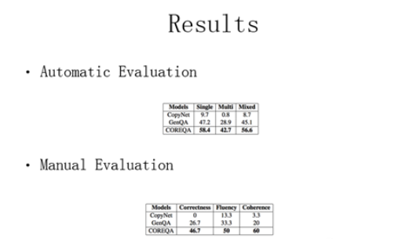

> 本文整理自刘康博士在 4 月 29 日广州知识图谱与问答系统论坛上的演讲。

> 刘康博士，现任中科院自动化所模式识别国家重点实验室副研究员。研究领域包括信息抽取、网络挖掘、问答系统等，同时也涉及模式识别与机器学习方面的基础研究。在自然语言处理、知识工程等领域国际重要会议和期刊发表论文三十余篇（如 TKDE、ACL、IJCAI、EMNLP、COLING、CIKM等），获得 KDD CUP 2011 Track2 全球亚军，COLING 2014 最佳论文奖，首届“CCF-腾讯犀牛鸟基金卓越奖”、2014 年度中国中文信息学会“钱伟长中文信息处理科学技术奖-汉王青年创新一等奖”、2015、2017 Google Focused Research Award 等。

---

大家好。我这个报告的题目是基于深度学习的知识库问答研究进展。其实就是想跟大家介绍目前在做面向知识库问答的时候，一个解决的方案是用Deep Learning 来做。

**1 问答系统的历史**

那么首先的话我们来回顾一下问答的一些历史的一些情况。我们现在用搜索引擎的话，其实用户来访问数据，还是以文档列表的形式。当用户问一个问题的时候，是需要用户在下面排序的结果中，来找到自己所需要的答案，其实搜索引擎并不能直接给你最精准的答案。另外，我们现在有各种各样的可穿戴设备，屏幕的缩小需要我们这个系统能够自动的从我们的数据库，或者我们的文本库里面，抽取最精准的答案。

那么这件事情的话，其实已经研究过很久了，但是最近有几件事情大力推动了问答系统的研究。2011年，华盛顿大学的Oren 教授在《Nature》上就提出：**问答系统是下一代搜索技术**的一种基本形态。同一年，IBMWaston在一个知识问答的比赛中，就已经战胜了人类的选手。目前，IBM 现在把这个 Watson 系统向各个行业去推，例如：医疗领域、金融领域，还有一些企业领域方面来推他们智能决策的系统。

那么我们来回顾一下**问答系统的历史**。那么整个问答系统的研究，其实是伴随着人工智能的发展而发展。早在上个世纪的60 年代的时候，开发了一系列**基于模板的专家系统**，但是后来随着研究推进，大家发现这种基于模板或者是用人工规则写的这种问答系统，不能够覆盖很多的领域和场景，或者说当你数据规模特别大的时候，这种规则的覆盖率就不能满足实际的需求。大概是进入90 年代之后，随着搜索技术的发展，很多针对基于模板的专家系统问答的研究，开始转向于基于**检索式问答的研究**。那么这种问答方式是通过用关键词搜索，先把相关的文档或者是句子找到，然后我再根据问题的核心语义，从搜索到的相关文档里抽取对应的答案。但是，研究者们发现这种问答模式，往往只能回答那些事实性问题，或者是说我预定类型的问题。

针对上述不足，现在很多这种大的互联网公司研发**面向社区的问答**，这种问答的形态是一个什么样的意思？就是系统并不来真正的回答问题，我只是说来维护一个很大的社区，所有的用户在上面提问题，这些问题又有其他的用户来问答，那系统只是看当前问题，是不是以前被回答过，如果被回答过，那历史上的这个问题的答案，就应该作为当前的这个问题的答案返回给用户。当然，系统还会做一些其他事情，比如说当一个新问题来的时候，我怎么来去找最佳的回答者，怎么来做一些问题的推荐等等。那么这块是我们大家经常会用的比较多的商业化的问答引擎，比如说雅虎Answer， 百度知道，包括我们经常用的知乎、搜狗问问等等都是这一类的系统。但这种问答模式的**核心还是基于这种浅层的关键词匹配的技术**，并没有真正的去理解这种文本或者是文字后面真正的语义。那么大概是在 2010 年的时候，谷歌提出了KnowledgeGraph的概念，试图从数据源，就已经把一些非结构化的纯文本的数据，我们变成了一些结构化的数据，在这样的结构化的知识图谱上面，我们怎么来做问答，我们就称之为 KB-basedQA，就是**基于或者面向知识图谱的问答系统**.

那么这样的话，我们就可以把问答系统大概分成这么三类，第一类的话就是**纯粹基于检索技术的检索式的问答**，它的核心技术特点，是基于关键词的匹配加信息抽取，还是基于浅层的语义分析系统，代表的系统有TREC, IBM Waston。第二类是**基于社区的问答**，那么基本上的问答方式是基于网民的贡献，问答过程还是依赖于关键词的检索的技术，代表的产品就是百度知道，知乎等等。第三类就是我们今天讲的重点，**面向知识图谱，或者知识库的问答系统**。核心是面对知识图谱或者知识库，如何正确理解用户问题的语义，在知识图谱中找到对应的答案。目前，我们已经看到很多的知识库问答的商业应用，比如说我们去访问Wolframe|Alpha 这样的知识问答的引擎，当我们输入中国有多大，它会直接给你中国的国土的面积，包括海洋面积等等。我们在百度上问姚明的个子有多高，百度会直接给出答案，这其中背后都是基于知识库的问答技术。

**2 知识库问答**

那我们再回过头来，知识图谱或者知识库是一个什么样的样子，刚才徐老师也介绍了。目前已有的知识图谱，就是描述了实体和实体之间的关系，是由三元组所构成的一种图状的结构。比如说在这里头，每一个节点其实表示一个实体，或者是一个概念，边就表示实体和实体之间语义关系，这种关系可以有属性关系，也有上下位关系等。

那我们要来做这样知识图谱的问答，就是要做这样一件事情，当用户有一个问题的时候，我首先通过语义解释手段，把这个问句解析成某种语义表示，然后再通过语义匹配、查询，甚至是语义推理的技术，在这个知识图谱上找到所对应的答案。那么根据这种语义表示的方式，现在已有知识库问答方法大致可以分为两类，**第一类是基于符号表示的知识库问答方法，第二类是基于分布式表示的知识库问答方法**。第一类方法是用语义解析的手段对于问句的语义进行解析，称之为Semantic Parsing。第二类是基于分布式的语义表示的方法，这一类的方法，我们可以看成信息检索的方法，因为你已经把用户的问题，表示成了一些实数的向量，那我就可以通过向量和向量之间相似的计算，获取相应的答案。

那我们再来看看传统的Semantic Parsing 的方法一个基本的流程，我们知道来访问的结构化的知识图谱的数据，最直接的手段，就是我们用一个结构化的查询语句。不管是 SQL 语句，还是SPARQL 语句，它的核心就是要用一个结构化的数据，就是查询语句，这个查询语句定义你要查的什么东西，然后后面有一些约束对于答案进行限定。那 SemanticParsing任务，就是怎么把一个自然语言的问句转换成一个结构化的查询语句。现在主流的方法都是将当前问句转化为逻辑表达式，然后通过这个逻辑表达式，加上一些规则，将其转换为结构化查询语句。举个例子来说，比如说这个例子是说姚明的老婆的出生是在哪里？那如果是用结构化语句就是我们要查一个X，Y 的出生地是 X，然后 Y 又是姚明的配偶。

但是在问句中并不是所有文本片段都能和知识图谱中概念、实体和关系直接完全匹配。比如说在知识图谱中，我们可以定义很多的实体或者是关系，比如说一个州的名字，它的符号表示，都是我在知识图谱中已经定好了。但是我们在文本中的话，往往是这些概念和关系的另外的一种表达方式，比如说德克萨斯州，entitymention 是 Texas State。就是说这逻辑表达式定义的符号，甚至这种实体的概念的符号，关系的符号和其在文本中表达，是有差异的。因此，整个问答过程就可以写成这样的基本步骤。

我们首先是对于这一段文本，我们要做一些短语识别，我们希望里头能识别到一些关键的短语，然后我们要把这些短语和我知识图谱定义好的概念和关系进行映射，比如说姚明，能够定义一下姚明，国籍能够定义国籍，老婆这个词，我们对应到配偶这个关系。然后在定义好了这些概念和关系之后，我来对他们进行语义的组合，形成了若干了三元组，那么这三元组再组成起来，就可以形成这个结构化的查询语句。这里头包含大量的这种自然语言处理的核心的技术，包括分词、词性标注、实体识别、关系抽取、实体链接、语法分析、语义分析等等。

那么这里头这其实最最核心的问题是什么？就是两个核心的问题，第一个我怎么来获得一个词典，把知识库中一些概念，或者已经定义的概念和关系，和我文本中的短语对应在一起。那么有了这些对应之后，第二个解决的问题就是说，我们利用不同的规则，甚至不同的方法，然后我在相同的对应条件下，我甚至可以得到不同的逻辑表达式。那么哪一个才是正确的，就是一个消歧问题。

那么已有的方法有很多这样的方法来做这样一些事情，那么我们今天就简要介绍一个最经典的方法，也就是CCG，即组合范畴语法。组合范畴语法有两部分，其实第一部分的话就是**词典**，那么词典里头定义了我文本中的一段文本的表达，和我知识图谱中，或者知识库中一个概念或者关系的这种对应关系，比如说对于这样的一个例子来说，纽约这样一个短语在知识图谱应该对应NY 这样一个节点，当然它是有条件的，纽约这个是在句子中作为名词或者名词短语时候，应该对应到知识图谱中的实体。另外一个例子，如果 borders 连接这个词，如果在文本中有这样的语法的范畴类别的话，那么在知识图谱中，应该对应next_to这个二元关系，就是有这样的一些词典能够帮助，在对应文本中，我能够把这些文本对应到知识图谱中的一些概念的关系。

第二，在CCG 中有**一些语义组合规则**，就是自底向上地，不断地把一些映射后的语义单元进行语义组合，形成最后的一个逻辑表达式。已有研究已经有很多。这一类方法的主要问题是什么？就是在开放域环境下，如何进行Semantic Parsing，意思就是说如果知识图谱规模特别大的时候，我不可能对于每一个概念，每一个关系都能够找到它的文本的对应，那么就是牵涉到一个问题，我的这些词典应该如何获取？第二个问题，如果你的数据规模特别大的话，我怎么来做这样的消歧的工作，那么已有的一些方法是PCCG，MLN。那么不管是怎么样，传统的这些方法，都是基于一个符号的匹配，那我们知道只要是涉及到符号的匹配，就会牵涉到一个很严重的问题，就是**自然语言中的语义鸿沟问题**。就是说你两个词完全是符号上是匹配不上的，但是它背后表达的语义是相近的，这是一个很严重的问题。

**3 深度学习下的知识库问答方法**

基于这些问题，很多研究者，开始逐渐投入基于深度学习的知识库问答方法。基于深度神经网络，我们能把不同符号映射到一个语义空间中，将其表示成一些数值向量形式，也就是说把符号表示成分布式向量表示的形式，然后，通过向量和向量之间的运算，就能一定程度上解决或者是缓解语义鸿沟的问题。

那么现在把深度学习放到知识库问答的方法，大概可以分为这么两类，**一类**方法是Deep Learning对于传统方法的改进，仍然按照传统的 SemanticParsing框架来做，还是需要实体识别、关系抽取等，只不过是在某一个环节，用 Deep Learning 来替代传统方法。比如说我们用深度学习来做关系的抽取，我用深度学习来做实体的链接等等。那么**另外一类**研究者，开始研究基于深度学习的 End2End 的端对端的问答模型，那这是一个什么样的思想？其实就是说我通过深度神经网络，例如我们现在经常用的卷积神经网络，或者是循环神经网络，把一个问句转换成一个向量的形式，那同时我又可以通过图上表示学习，把一个知识图谱中所有的实体或者是关系，表示成一个向量的形式。那么现在这个问答的过程，就变成了一个检索的过程。如果问句的向量，在这个知识图谱里头去查一查，哪个实体或者关系的向量和我当前的这个问句的向量相似度比较近的时候，那这个知识图谱中的实体就应该是当前问句的答案给输出来。

那么**核心就是有两个问题**，第一个问题就是我怎么来学一个问句表示和学一个知识图谱表示，第二个问题我怎么来计算他们之间的相似度。那么这块的工作其实是从2014 年开始，研究者开始来投资这方面的工作，最早的话其实是 FaceBook 研究员 Bordes 来开展这样的一些研究。那么其本做法是什么样的？大概包含两步，第一步，在这个问句中，我们需要找到一个实体，然后我找到这个实体在知识库所对应的节点，我们称之为main entity，然后这时候就会假设在这个知识图谱中，这个 main entity 周围的一些节点，可能就是跟这个问答的语义是比较接近的，可能就是这个问答的答案。那么第二步我要做的工作就是，对于mainentity周围的那些实体进行一个排序，哪个排在最前面，哪个就是相对应的答案，比如说姚明的老婆国籍？这么一个简单的问题的话，我们首先找到姚明这个节点，我再看他周围的节点有哪些，总有一个节点可能就是答案，肯定离姚明的节点不远。那么具体来说是怎么做呢？Bordes最早的工作对于问句来说的话，把这个问句中所有的词的**词向量取了一个平均**，作为当前的这个问句的语义的表示，那么对于每一个侯选答案来说，它用周围的这些实体的向量的平均，作为当前这个侯选答案的表示，那么学习的过程完成是一个端对端的学习过程。目标函数是什么，就是使得假如说我有训练的数据，就是使得我当前这个问题和它所对应的答案的表示，相似度越近越好。就是这么一个简单的学习的过程。

那么 Bordes 随后在另外一个工作中，对他的这么工作进行了一个简单的改进，具体是怎么做的呢？就是说在上一个工作基础上，他特别的是考虑了一个实体和到一个候选答案，它们在知识图谱中的路径，和我问句的语义的匹配程度。

那么可以看一下，当时的这种工作的结果，上面这个2013 年的结果是传统 Semantic Parsing 的这个方法，那么 Bordes 2014 年最初的那个结果上，还不能超过传统的方法，但是在后面改进的方法上，已经能够与之前的基于完全符号的匹配的方法能够有好的这么一个结果。

其实微软也是这么做的，在2015 年微软的工作，其实就是从不同的侧面来考虑问句和答案之中的匹配程度，比如说我要问姚明的老婆是谁，说问句里面有一个关键词“谁”，那么这个“谁”的话，其实就是在问这个答案，说明答案是一个人。那如果你这个侯选答案的这个type 不是一个人的时候，那可能就不是这样的一些答案。那它从三个侧面来考虑了问题和答案的相似度，一个是答案的类型，一个是答案的上下文，一个是答案到主实体之间的路径，是不是和我文本中表达出来的关系是一致的。那么在问句的表达这块，就用了三个卷积神经网络来分别学习问句的语义表示，而在知识图谱中把任何一个侯选答案的type，context 和 Path 的信息分别提出来，再分别和问句的三个卷积神经网络学出来的向量表示来计算相似度，最后给出一个这样的打分。

那么可以看看这样的方法，相对于Bordes 以前的方法，已经能够达到特别好的一个结果，F1 准确率的话，从 31% 就可以提升为 40.8%。

那我们自己其实也这方面做了一点点的工作，那我们首先认为**传统像 Bordes 这样用 Word Embedding 平均对问题语义表示，就表示的方式而言是过于简单了**。我们类似于像微软的工作，我们认为**对于问句是会随着对于答案不同方面的关注而应该是不同的**。比如说刚才那个问题，如果姚明的老婆是谁，那么如果我关注到答案的类型是一个人的话，那么问句的表示不应该偏向于“谁”那个词，如果我们关注到老婆这个关系的时候，我应该关注到答案中叶莉和姚明之间的那个路径那个信息。

另外，已有的这些方法来学习知识库这些实体和概念这种表示的时候，一般都是受限于训练语料，那么在训练语料以外出现的一些实体和关系，通过已有方法是根本学不到的。那么我们也知道其实在知识图谱一个实体和关系的表示，其实是受到知识图谱所有的全局的实体和概念相互的约束，那么我们有没有一个方法，事先能够学习到一些知识图谱的表示信息，把这种先验的知识加入到我学习的过程中，这是我们两点基本出发点。

那么这样的话我们就提出了这么一个网络，这个网络也是非常简单，其实就是说我们也是从四个方面来考虑的答案和问句之间的匹配程度。第一个是答案本身的 entity 的一种表示，第二个答案和主实体关系的相似度，第三个是答案的类型，类型到底是什么，第四个是答案的上下文的信息。那么对于问句这块的表示，我们就用了一个双向循环神经网络，来学习一个问句的表示。

另外的话我们在知识库中，每一个实体的 type, context, path 和它本身我们把它的向量取出来。那么这个向量会影响问句的语义表示。也就是问句的表示，要分别和这四个向量来算相似度，在算相似度之前，我应该先确定，对于问句的表示，应该更加关注哪一个词，我们会算一个 Attention。

我们从问句到知识库做一个 Attention，这是什么意思？我们同时是从对于问句的表示出发来计算上述四个方面相似度的权重，即，对于当前问题来说，答案的四个方面到底哪更重要一些。那比如说刚才那个问题，姚明的老婆是谁？那么肯定我们应该关注的他老婆的这个关系，以及他这个答案的类型是不是一个人。如果这两个能够确定的话，这个问题基本上就已经确定了，所以我们做了两个 Attention，一个是 Answer 到 Question 的 Attention，一个是从 Question 到 Answer 的 Attention，所以说是一个 Cross-Attention。那么学习的过程也是非常简单的，和之前的基础的学习模型得是一样的，就是要保证我们训练里头的我的问句和答案的相似度，应该更加的相似。

另外我们用了 TransE 模型，来得到知识图谱的实体和概念这种向量。TransE 也是一个可学习的模型，它就假设在知识图谱中任何一个三元组，是由一个 h 和关系 r 和另外一个实体t 来组成的，那它们之间的表示，应该是符合这种加性的关系。利用这种方式的话，我们可以事先学习到知识图谱中所有实体和概念或关系的向量，而这个学习是全局的学习过程。学出的结果可以作为知识图谱中实体、关系表示的先验。最后，我们将上面两个学习过程加入了一个 Multi-task Learning 的框架。

那我们直接看一下实验结果，那么相对于传统的 end2end 的方法，不管是 Bordes 还是说微软的方法的话，我们现在这个方法都能够达到一个最优的这种结果，那么我们也在这种参数上做一些调整，比如说我们用了单向的 LSTM 来做问句的学习，我们用双向 LSTM，要比单向 LSTM 要好一些，然后我们在双向 LSTM 里头，加入了 Attention，是从不同的方向来算 A-QAttention，还是 Cross-Attention，最后证明这种 Cross-Attention 效果要好一些。

另外我们也加入了事先学习的知识图谱的中的实体和概念的向量的全局化的信息，我们可以看到最后的结果，就是说我们注入Cross-Attention，同时加入全局信息，能够达到一个很好的结果。那么这块的话是一个热图 Where is the carpathianmountain range located。就是说问一个山的地方到底是处于哪个国家？我们可以看到，当我们关注到这个答案的类型的时候，这个答案的类型是一个country ，哪个词的权重最大？是 Where 这个词，那就说明这个 Attention 确实能够学到，根据答案不同方面的信息，关注到句子中正确的词。

这张图是现有的知识库问答方法，在公开数据 WebQuestion 上的比较结果。绿色的条相当于是传统的基于符号的Semantic Parsing 的方法，蓝色的条是基于传统 Semantic Parsing 的框架也好，局部的用深度学习的手段来进行解决，但是这样好的方法，应该都是用了很多很多的映射的资源或者是一些规则能够达到的。纯End2End 深度学习的方法，现在最好的结果能够达到 42.9% 的水平，所以说还需要我们更多地进行研究和探索来研究这类问题的方法。

**4 Natural Question Answering**

另外一个问题，我们现有的问答都是说你问一个问题，直接把知识图谱的相关答案给你了。比如说我要问姚明的身高有多少，一般人会给一个2米26，但是相对于这样的一些问题，我们另外在对话场景下，我们需要自动地，或者是自然方式的问答。比如说，我现在问李连杰有多高，传统的KB-QA 就会给一个 1.64 米。但是对话式的方法，就应该回答 “李连杰有1.64米高”。这么一个自然语言的语句。这个过程其实是需要这样来做的，当一个问句来问，wherewas Jet li from？李连杰是从哪里来这么一个问句。我们希望它能够回答出这样一个句子，Jet li was born in Beijing，Heis now a Singaporean citizen。其实就是说有一些词是我要从知识图谱中获取的，比如说北京、新加坡，这是在知识图谱中能够获取的答案。有一些词是希望我们从原句话里面，直接Copy 过来。还有一些词，我们是希望通过语言模型的手段，能够自动把这句话生成出来的，当然里头还有一些推理的成分。比如说我回答的 He，其实我在知识图谱中知道了李连杰的性别是男性，我这里应该写一个He，而不是一个 She。

对于这样一个任务，要做这样的事情，也是用深度学习的手段来做，Sequence2Sequence的 RNN 网络。我前面有一个 RNN 来读用户的问题，对它进行**编码**；第二步用另外一个**解码**的 RNN 不断地生成一些词，能够完成我的对话。但是在生成的过程中，这个词到底是一个什么样的词，我们有三个来源：第一个来源，这个词是可以从知识图谱中查询得到答案而获取的；另外一种来源，可以是通过语言模型自动地去生成出来；第三个是从原句话里头直接copy 过去的。所以说有三个机制，一个是原模型的 prediction 机制，第二个是知识图谱中 Retrieval 事实的贡献，第三个是从原句话复制过来的。

针对这样的任务，我们就给出了稍微复杂一点的模型。其实就是说我同样是一句话，用一个双向的RNN 来计算语义的表达，同时事先假定，在这句话里，已经知道了它的主实体是什么，通过主实体在一个知识图谱中，可以找到与这个主实体相关的所有的三元组合。比如说李连杰的性别、出生年月、国籍、出生地的一些信息等等，然后我就可以通过知识图谱中，我把这些知识图谱中的这些 facts 给它向量化之后，我通过这个 facts 向量化，就可以影响这个问句的Attention 的机制。同时在我生成一句话，Jet li was born in Beijing 这句话的时候，前一个状态也会影响我的预测的过程，相当于前面出现一个born，下一个词应该出现 in，in 下一个词出现什么，我们专门有这么一个门的机制来确定当前这个词，到底是从原问句中复制来，还是从知识图谱检索的结果来，还是直接从语言生成过来。

数学化的形式表达，就是说我在生成的过程中，给定当前的那个状态，和前一个生成的结果，以及我在知识库中找到的所有事实的信息，以及前一个问句中的信息，怎么生成下一个词，可以用这个模型来替代。就是说我当前用这个语言模型生成一个词的概率，再判断当前应该用语言模型来处理的概率，加上我用copy机制生成这个词的概率，以及用知识图谱中的信息来生成这个词的概率，乘上当前需要用知识图谱的信息来回答的概率，这个模型完全都是可以用end2end 的方式来进行学习。

我们看一下我们的实验，我们大概设计了这样一个实验，首先有一个人工的数据集，这个数据集大概只能回答一个人的出生信息的问题，选了一些模板，我们根据已有知识图谱中的三元组，自动生成了一些问句。可以看看相对于标准的RNN 的一些 Attention 的机制，以及以前仅仅是 copy 或者是检索的方法。我们的方法大概是在回答一个人的性别、出生年、出生月、出生日等等一些相关的信息，都能够得到比较好的结果。

我们同时从网上抓了一些百度知道的一些问题，想看看对于实际的问题，它能够回答多少。我们先做了一些事情，就爬取了很多的CQA 的网页。同时我们看它哪个问题，如果有一个问题中，能够对应到我已有的中文知识库的时候，我就把这个问题留下来，在这样一个测试题上测我的系统，其实就是要保证这些问题在知识图谱中都能够找到对应的答案。

我们可以看到，和以前的一些神经网络方法、CopyNet、GenQA 这样一些方法，我们的方法都达到了一个比较好的结果。

我们也用人工来评测了一下，就是找了三个标注者，他们对于我们生成结果来看一下，这三个结果中，哪个结果是最好的。我们的方法，在正确度的评判上，好的大概是能达到46.7% 的准确率，在连贯性上，就是生成这个问题的连贯性，一半的结果都是我们的方法好。在回答的合理性，我们的方法也是达到最好的结果。

这里有一些例子，比如说他问马斯切拉诺是谁，在CQA 里头回答他是一名足球运动员，我们的系统回答是“一个优秀的足球运动员”，可以看到足球运动员，这都是从知识图谱中生成出来的，而一个优秀的这么一个词，是按照我们语言模型能够生成的。当然还有一些错误的，比如说电影铁三角是谁，应该是徐克、林岭东和杜琪峰，我们回答是有一些错误的。

我报告的内容大概就是这么多，我也是想给大家介绍一下，深度学习确实是能够在一定程度上，能够解决我们在知识库问答中所遇到的一些词汇鸿沟的问题，也请大家来关注，用深度学习来做知识库问答的方向，谢谢大家！

